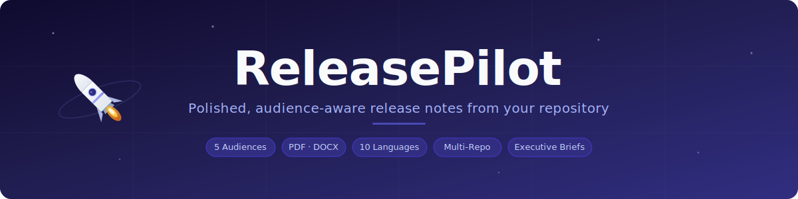
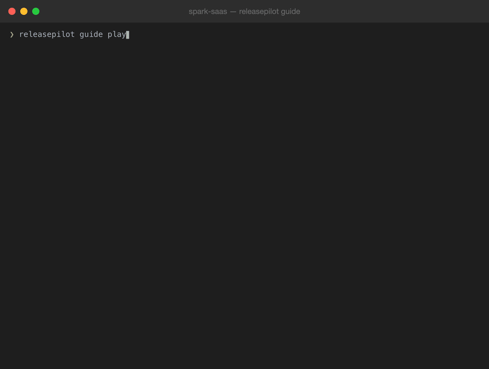

<p align="center">
  
</p>

<p align="center">
  <a href="https://github.com/polprog-tech/ReleasePilot/actions/workflows/ci.yml"></a>
  <a href="https://github.com/polprog-tech/ReleasePilot/blob/main/LICENSE"></a>
  
  
  
</p>

<p align="center">
  <a href="https://buymeacoffee.com/polprog"></a>
  <a href="https://github.com/sponsors/polprog-tech"></a>
</p>

<p align="center">
  <b>Generate polished, audience-aware release notes from any git repository.</b><br>
  <sub>Executive briefs · Customer-facing notes · Technical changelogs · Translated output · PDF &amp; DOCX export</sub>
</p>

<p align="center">
  <a href="#installation">Installation</a> •
  <a href="#quick-start">Quick Start</a> •
  <a href="#guided-workflow">Guided Workflow</a> •
  <a href="#audience-modes">Audience Modes</a> •
  <a href="#output-formats">Output Formats</a> •
  <a href="#playground">Playground</a> •
  <a href="#architecture">Architecture</a>
</p>

---

## What is ReleasePilot?

ReleasePilot turns source changes — git commits, tags, pull requests, structured metadata — into polished release notes for different audiences. It is **not** a raw changelog dump. It classifies, filters, deduplicates, and groups changes to produce release communication that reads naturally.

**Key features:**

- **Conventional Commits** parsing with keyword-based fallback
- **Audience-aware** output (technical, user-facing, summary, changelog, executive, narrative)
- **Multiple formats** (Markdown, plain text, JSON, PDF, DOCX)
- **Noise filtering** (merge commits, WIP, fixups, trivial changes)
- **Deduplication** (PR grouping, near-duplicate detection)
- **Structured input** (JSON files for CI pipelines or manual supplementation)
- **Deterministic** output — same input always produces the same result
- **Guided workflow** — interactive prompts, branch detection, time ranges
- **Robust error handling** — user-friendly messages with suggestions, never raw errors
- **Executive briefs** — polished management/board-ready reports from technical data
- **Pipeline transparency** — shows how many items were collected, filtered, deduplicated
- **Multi-repository** — generate notes from multiple repos in one run
- **Config file** — preload defaults from `.releasepilot.json`, `.releasepilot.toml`, or `pyproject.toml`
- **Auto app name** — repository name used as application name by default
- **Config validation** — schema-validated config with clear warnings for invalid values
- **Branch validation** — invalid branches are rejected with available-branch suggestions
- **Overwrite protection** — warns before overwriting existing output files
- **Multi-language** — all structural labels translated (10 languages) across Markdown, PDF, DOCX
- **Extensible** pipeline architecture for future integrations

---

## Table of Contents

- [Installation](#installation)
- [Guided Workflow](#guided-workflow)
- [Quick Start](#quick-start)
- [Commands](#commands)
- [Audience Modes](#audience-modes)
- [Output Formats](#output-formats)
- [Configuration](#configuration)
- [CI/CD Integration](#cicd-integration)
- [Data Sources](#data-sources)
- [Error Handling](#error-handling)
- [Troubleshooting](#troubleshooting)
- [Examples](#examples)
- [Playground](#playground)
- [Architecture](#architecture)
- [Testing](#testing)
- [CI / Quality](#ci--quality)
- [Extending ReleasePilot](#extending-releasepilot)
- [FAQ](#faq)
- [Contributing](#contributing)
- [Author](#author)
- [License](#license)

## Installation

**Requirements:** Python 3.12+

```bash
# Clone and install in development mode
git clone https://github.com/polprog-tech/ReleasePilot.git
cd ReleasePilot
python3 -m pip install -e ".[dev]"

# With PDF/DOCX export support
python3 -m pip install -e ".[export]"

# With translation support
python3 -m pip install -e ".[translate]"

# All extras (dev + export + translate)
python3 -m pip install -e ".[all]"
```

Verify the installation:

```bash
releasepilot --version
```

> **Note:** The install command assumes Python 3.12+ and pip are available on your system. If you use a virtual environment manager (venv, conda, etc.), activate your environment first.

> **Important:** These install commands apply to **ReleasePilot itself**, not to the repository you want to analyse. ReleasePilot works with any git repository — Python, JavaScript, Rust, Go, or any other language. The target repository does not need to be a Python project.

## Guided Workflow

ReleasePilot includes an **interactive guided workflow** designed for QA engineers, testers, and product stakeholders who want to generate release notes without knowing git refs or tags.

<p align="center">
  
</p>

<p align="center"><sub>The guided workflow walks you through branch selection, time range, audience, format, and language — then generates polished release notes.</sub></p>

### Usage

```bash
# Start the guided workflow in the current directory
releasepilot guide

# Or point to a specific repository
releasepilot guide /path/to/repo

# Or provide a remote repository URL (cloned automatically)
releasepilot guide https://github.com/user/repo

# Reset saved preferences
releasepilot guide --reset-preferences
```

### How it works

The `guide` command walks you through these steps:

1. **Repository resolution** — accepts a local path or remote URL. Remote URLs are cloned to a temp directory automatically.
2. **Repository inspection** — validates the repo and gathers metadata (with spinner)
3. **Changelog detection** — checks for existing `CHANGELOG.md`, `RELEASE_NOTES.md`, or similar files. If found, asks whether to use them (with a warning that existing docs may be outdated)
4. **Branch selection** — detects the default branch (`main` or `master`), shows available branches, validates the selection. Invalid branches are rejected — you must provide a valid branch before proceeding.
5. **Time range** — pick a window: last 7, 14, 30, 60, or 90 days, or enter a custom value. Custom input accepts either a date (`YYYY-MM-DD`) or a number of days back (e.g. `30` = last 30 days). Both formats are validated.
6. **Audience** — choose between changelog, user-facing, technical, summary, customer-facing, or executive/management. Default: Executive.
7. **Format** — choose output format. Executive audience defaults to PDF for polished sharing.
8. **Custom title** — optionally add a subtitle (trimmed, max 200 chars). The repository name is always used as the application name at the top.
9. **Generation** — runs the full pipeline (with progress spinner)
10. **Preview & export** — displays the result and offers to save. If the target file already exists, asks whether to overwrite, rename, or cancel.
11. **Cleanup** — if a remote URL was cloned, asks whether to remove it

### Interactive navigation

Every menu prompt supports two interaction modes:

| Mode                   | How to use                                         |
|------------------------|----------------------------------------------------|
| **Arrow-key selection**| Use ↑/↓ arrows to move, Enter to confirm           |
| **Numeric entry**      | Type the option number (e.g. `2`) and press Enter  |

Arrow-key navigation is available when running in a real terminal with `questionary` installed (included by default). In non-TTY environments (CI, pipes), validated numeric input is used automatically.

### Input validation

All interactive prompts are **strictly validated**:

- Out-of-range numbers are rejected with a clear message
- Non-numeric input is rejected with a clear message
- Invalid choices never silently proceed
- The menu choices are re-displayed after each error
- The user is kept in the current step until a valid selection is made

Example of invalid input handling:

```
👥 Target audience

   [1] Standard changelog
   [2] User-facing / What's New
   [3] Technical / engineering notes
   [4] Concise summary
   [5] Customer-facing product update
   [6] Executive / management brief (default)

Choice: 7
  ⚠ Option 7 is not available. Please enter a number from 1 to 6.

   [1] Standard changelog
   [2] User-facing / What's New
   [3] Technical / engineering notes
   [4] Concise summary
   [5] Customer-facing product update
   [6] Executive / management brief (default)
   [5] Executive / management brief

Choice:
```

### Auto-detection behavior

| Feature               | Behavior                                                              |
|-----------------------|-----------------------------------------------------------------------|
| **Changelog files**   | Scans for `CHANGELOG.md`, `CHANGES.md`, `HISTORY.md`, `RELEASE_NOTES.md`, `docs/changelog.md`, and variants |
| **Default branch**    | Checks `refs/remotes/origin/HEAD`, then tries `main` → `master` → `develop`, then uses first branch |
| **Time range default**| 30 days                                                               |
| **Audience default**  | Executive / management brief                                          |
| **Format default**    | Markdown                                                              |
| **Yes/No prompts**    | Enter accepts the displayed default (capital letter = default)        |
| **Save prompt default** | Yes — pressing Enter saves the file by default                     |

### Remote repository URL support

You can pass a GitHub (or any git) URL directly to the guided workflow:

```bash
releasepilot guide https://github.com/user/repo
releasepilot guide git@github.com:user/repo.git
```

ReleasePilot will:
- Clone the repository to a temporary directory (with progress spinner)
- Run the full guided workflow on the cloned repo
- After completion, ask whether to remove the clone

Limitations:
- Requires `git` to be installed and available in PATH
- Clone depth is limited to 200 commits for speed
- Clone timeout is 120 seconds
- Only local analysis is performed (no GitHub API integration)

### Progress feedback

Long-running operations show spinners so you always know what's happening:

- **Inspecting repository...** — during repo validation
- **Cloning repository...** — when using a remote URL
- **Collecting and analyzing changes...** — during pipeline execution with granular stage labels:
  - Collecting commits
  - Analyzing changes
  - Grouping release items
  - Preparing statistics
  - Translating output
  - Rendering document
  - Exporting PDF/DOCX
- **Rendering and exporting document...** — when saving PDF or DOCX files (translation and rendering happen at this stage)

### Smart defaults (remembered preferences)

After you repeat the same guided workflow choice 3+ times, ReleasePilot remembers it and uses it as the default for next time. This applies to:

- Audience mode
- Output format
- Branch selection

Preferences are stored in `~/.config/releasepilot/preferences.json` and are scoped per-machine.

| Action | Command |
|--------|---------|
| View preferences | `cat ~/.config/releasepilot/preferences.json` |
| Reset all preferences | `releasepilot guide --reset-preferences` |
| Disable preferences | Set `RELEASEPILOT_NO_PREFS=1` environment variable |

Preferences never override your explicit choices — they only change which option is pre-selected when the menu appears.

### Date-range history bounds

When the selected time range extends further back than the repository's actual history, ReleasePilot detects this automatically:

- The tool checks the date of the oldest commit in the repository
- If the requested start date is before the first commit, it adjusts to the first commit date
- A warning is displayed explaining the effective analysis range

For example, if you select "Last 60 days" but the repository only has 20 days of history:

```
⚠  Requested start date (2025-05-01) is before the first commit (2025-05-25).
   Analysis will start from the first available commit instead.
```

This avoids misleading output that implies the repository was analyzed for a period it didn't exist.

### Date-range mode (CLI)

The date-range feature is also available in non-interactive commands:

```bash
# Generate notes from the last month on a specific branch
releasepilot generate --since 2025-02-01 --branch main --version 2.0.0

# Preview commits from the last 2 weeks
releasepilot preview --since 2025-03-01 --branch develop

# Export with date range
releasepilot export --since 2025-01-01 --branch main -o notes.md
```

The `--since` flag accepts ISO date strings (`YYYY-MM-DD`). When used, `--from`/`--to` are not required.

## Quick Start

**Generate notes from a structured file:**

```bash
releasepilot generate --source-file examples/sample_changes.json --version 3.0.0
```

**Generate notes between two git tags:**

```bash
releasepilot generate --from v1.0.0 --to v1.1.0 --version 1.1.0
```

**Generate notes since the last tag:**

```bash
releasepilot generate --version 2.0.0
```

**Generate notes from the last 30 days:**

```bash
releasepilot generate --since 2025-02-01 --branch main
```

**Interactive guided workflow:**

```bash
releasepilot guide
```

**Preview in the terminal:**

```bash
releasepilot preview --source-file examples/sample_changes.json
```

**Export to a file:**

```bash
releasepilot export --source-file examples/sample_changes.json -o RELEASE_NOTES.md
```

**Export as PDF or DOCX:**

```bash
releasepilot export --source-file examples/sample_changes.json --format pdf -o release.pdf
releasepilot export --source-file examples/sample_changes.json --format docx -o release.docx
```

**Executive brief for management/leadership:**

```bash
# Markdown executive brief
releasepilot generate --source-file examples/sample_changes.json --audience executive --version 3.0.0

# PDF executive brief (recommended for stakeholders)
releasepilot generate --source-file examples/sample_changes.json --audience executive --format pdf --version 3.0.0

# DOCX executive brief
releasepilot export --source-file examples/sample_changes.json --audience executive --format docx -o brief.docx --version 3.0.0
```

**Dry-run (preview pipeline without rendering):**

```bash
releasepilot generate --source-file examples/sample_changes.json --dry-run
```

**Custom title with application name:**

```bash
releasepilot generate --from v1.0.0 --to v1.1.0 --app-name "Loudly" --title "Monthly Release" --version 1.1.0
```

**Generate translated release notes:**

```bash
# Polish output
releasepilot generate --source-file examples/sample_changes.json --language pl --version 2.0.0

# German output
releasepilot generate --since 2025-01-01 --language de --branch main
```

## Commands

| Command     | Purpose                                            |
|-------------|----------------------------------------------------|
| `generate`  | Generate release notes and print to stdout         |
| `preview`   | Preview release notes in a styled terminal panel   |
| `collect`   | Inspect raw collected changes before processing    |
| `analyze`   | Show classification, grouping, and filtering stats |
| `export`    | Write release notes to a file                      |
| `multi`     | Generate from multiple repositories at once        |
| `guide`     | Interactive guided workflow                        |

### Common Options

All commands accept:

| Option            | Description                                       |
|-------------------|---------------------------------------------------|
| `--repo`          | Path to git repository (default: `.`)             |
| `--from`          | Start ref (tag, commit, branch)                   |
| `--to`            | End ref (default: `HEAD`)                         |
| `--source-file`   | JSON file with structured changes                 |
| `--version`       | Release version label                             |
| `--title`         | Custom title phrase (e.g. "Monthly Release")      |
| `--app-name`      | Application/product name (e.g. "Loudly")          |
| `--language`      | Output language code (default: `en`)              |
| `--branch`        | Branch to analyze (for date-range mode)           |
| `--since`         | Collect commits since date (`YYYY-MM-DD`)         |
| `--dry-run`       | Show pipeline summary without rendering           |

### Generate / Export Options

| Option            | Description                                         |
|-------------------|----------------------------------------------------|
| `--audience`      | `technical`, `user`, `summary`, `changelog`, `customer`, `executive`, `narrative`, `customer-narrative` |
| `--format`        | `markdown`, `plaintext`, `json`, `pdf`, `docx`     |
| `--show-authors`  | Include author names in output                     |
| `--show-hashes`   | Include commit hashes in output                    |

## Audience Modes

ReleasePilot generates different output depending on the target audience:

| Audience      | For whom | Detail level | Internal categories | Customer-safe | Leadership-ready | Description |
|---------------|----------|-------------|---------------------|--------------|-----------------|-------------|
| `technical`   | Engineers, DevOps | Full — raw commit data | ✅ Included | ❌ | ❌ | Everything as-is: refactors, infra, all titles unchanged |
| `changelog`   | Developers, open-source users | Full — polished titles | ✅ Included | ⚠️ Possible | ❌ | All categories with capitalized/cleaned titles |
| `user`        | End users, product teams | Moderate — user-relevant only | ❌ Hidden | ✅ | ❌ | Hides refactors/infra/other, polishes wording |
| `summary`     | GitHub releases, newsletters | Minimal — top highlights | ❌ Hidden | ✅ | ❌ | Max 3 items per group, hides docs/internal |
| `customer`    | External customers | High-level, outcome-focused | ❌ Hidden | ✅ | ❌ | No commit refs, scopes, or authors; customer-friendly language |
| `executive`   | Leadership, board, stakeholders | Business-oriented | ❌ Hidden | ✅ | ✅ | Business language, impact themes, risk analysis |
| `narrative`   | Stakeholders, product managers | Full — readable prose | ✅ Included | ✅ | ✅ | Continuous paragraph text, fact-grounded narrative |
| `customer-narrative` | External customers | Non-technical prose | ❌ Hidden | ✅ | ❌ | Polished customer-friendly narrative, no internal details |

```bash
# Engineering release notes
releasepilot generate --source-file changes.json --audience technical

# Customer-facing "What's New"
releasepilot generate --source-file changes.json --audience user

# Customer product update (no technical details)
releasepilot generate --source-file changes.json --audience customer

# GitHub release body
releasepilot generate --source-file changes.json --audience summary --version 3.0.0

# Executive brief for leadership
releasepilot generate --source-file changes.json --audience executive --version 3.0.0

# Fact-grounded narrative for stakeholders
releasepilot generate --source-file changes.json --audience narrative --version 3.0.0

# Customer-facing narrative (polished prose, no internal details)
releasepilot generate --source-file changes.json --audience customer-narrative --version 3.0.0
```

### Executive / Management Brief

The `executive` audience transforms technical release data into polished business communication:

- **Executive Summary** — 2-4 sentence overview of what was delivered
- **Key Achievements** — Top highlights rewritten for business audiences
- **Impact Areas** — Changes grouped by business theme (New Capabilities, Quality & Reliability, Security & Compliance, etc.)
- **Risks & Attention Items** — Breaking changes and deprecations framed as business risks
- **Recommended Next Steps** — Actionable follow-up items
- **Release Metrics** — Summary statistics

The executive mode does **not** dump raw commits. It:
- Removes technical noise (refactors, infrastructure, documentation)
- Strips conventional commit prefixes (`feat:`, `fix:`, etc.)
- Groups changes into business-oriented themes
- Generates natural-language summaries
- Produces documents suitable for direct stakeholder sharing

```bash
# PDF for board review
releasepilot export --source-file changes.json --audience executive --format pdf -o brief.pdf --version 3.0.0

# DOCX for management
releasepilot export --source-file changes.json --audience executive --format docx -o brief.docx --version 3.0.0

# JSON for integration
releasepilot generate --source-file changes.json --audience executive --format json --version 3.0.0
```

### Choosing the right audience mode

| Question | Recommended mode |
|----------|-----------------|
| "I want the full raw changelog for developers" | `technical` |
| "I want a standard changelog with clean titles" | `changelog` |
| "I need customer-facing What's New notes" | `user` |
| "I need a clean product update for external customers" | `customer` |
| "I need a short summary for a GitHub release" | `summary` |
| "I need a report for management or leadership" | `executive` |
| "I need a readable narrative for stakeholders" | `narrative` |
| "I need polished prose for customer communications" | `customer-narrative` |

### Narrative Output Modes

The `narrative` and `customer-narrative` audiences produce **continuous prose** rather than bullet lists. Unlike all other modes which output structured lists, these generate readable paragraph-based text.

- **`narrative`** — full narrative covering all change categories; suitable for stakeholders and product managers
- **`customer-narrative`** — non-technical narrative hiding internal categories; suitable for customer emails and product updates

Both modes are **strictly fact-grounded**: the generated text is traceable to the underlying source changes. The system includes a claim validator that prevents marketing language, speculative claims, and hallucinated content.

```bash
# Stakeholder narrative
releasepilot generate --source-file changes.json --audience narrative --version 3.0.0

# Customer-facing narrative
releasepilot generate --source-file changes.json --audience customer-narrative --version 3.0.0

# JSON with full fact layer for auditability
releasepilot generate --source-file changes.json --audience narrative --format json --version 3.0.0
```

For full details, see [docs/narrative-mode.md](docs/narrative-mode.md).

### Customer-Facing Product Update

The `customer` audience generates polished output suitable for external customers:

- **No technical details** — commit hashes, PR numbers, scopes, and author names are hidden
- **Aggressive filtering** — infrastructure, refactoring, documentation, deprecation, and internal changes are removed
- **Outcome-focused** — only features, improvements, bug fixes, performance, and security changes are shown
- **Item limit** — max 5 items per category to keep the output concise
- **Clean titles** — all titles are polished for readability

This mode produces output that reads like a product update newsletter rather than a developer changelog.

### When to use `technical` vs `changelog`

Both include all categories, but `changelog` polishes titles (capitalizes first letter, cleans formatting) while `technical` returns raw commit data unchanged. Use `technical` for internal engineering records; use `changelog` for published changelogs.

## Output Formats

| Format      | Use Case                                               | Install              |
|-------------|--------------------------------------------------------|----------------------|
| `markdown`  | GitHub Releases, CHANGELOG.md, docs sites              | Built-in             |
| `plaintext` | Terminal review, email, plain documentation             | Built-in             |
| `json`      | CI/CD integration, API consumption, tooling             | Built-in             |
| `pdf`       | Stakeholder handoff, archival, management review        | `pip install "releasepilot[export]"` |
| `docx`      | Internal release docs, customer communication           | `pip install "releasepilot[export]"` |

### PDF / DOCX Export

PDF and DOCX exports produce **professional, polished documents** suitable for direct sharing:

- Styled title/version/date header
- Section headings for each change category
- Highlights and breaking changes sections
- Bullet lists with optional metadata (scope, authors, hashes)
- Clean typography, spacing, and page layout

```bash
# PDF export
releasepilot export --source-file changes.json --format pdf -o release.pdf --version 3.0.0

# DOCX export
releasepilot export --source-file changes.json --format docx -o release.docx --version 3.0.0

# PDF with author names
releasepilot export --source-file changes.json --format pdf -o release.pdf --show-authors
```

> **Note:** PDF and DOCX require the `export` optional dependencies. Install with: `pip install "releasepilot[export]"`

### Application Name & Custom Title

The **repository name** is always used as the application name at the top of generated documents — centered, visually prominent, and alone on its own line.

You can optionally add a **custom subtitle** below it (e.g. "Monthly Release Overview", "Q1 Delivery Summary").

Document layout (PDF, DOCX, Markdown):
```
           LoopIt                    ← repository name (automatic, centered)

  Monthly Release Overview           ← custom subtitle (optional)
  Version 2.0.0                      ← version info
  Changes: 2025-01-01 to 2025-03-16 ← date range metadata
```

The repository name always appears **alone** on its own line at the very top — never merged with the subtitle. In PDF and DOCX, it is centered at 28pt. The subtitle and metadata appear below it.

Examples:
| `--app-name` | `--title` | `--version` | Result |
|---|---|---|---|
| Loudly | | 2.0.0 | **Loudly — Release 2.0.0 — since 2025-01-01** |
| Loudly | Monthly Release | | **Loudly — Monthly Release** |
| Loudly | Q1 Summary | 3.1.0 | **Loudly — Q1 Summary — Version 3.1.0** |
| *(auto)* | Board Update | | **RepoName — Board Update** |

```bash
releasepilot generate --from v1.0.0 --to v1.1.0 --app-name "Loudly" --title "Sprint 14 Release" --version 1.1.0
```

In the guided workflow, the repository name is used automatically. You'll be prompted for an optional subtitle after selecting the output format.

### Translation Support

Release notes can be generated in **10 languages**:

| Code | Language   |
|------|------------|
| `en` | English    |
| `pl` | Polish     |
| `de` | German     |
| `fr` | French     |
| `es` | Spanish    |
| `it` | Italian    |
| `pt` | Portuguese |
| `nl` | Dutch      |
| `uk` | Ukrainian  |
| `cs` | Czech      |

**Static label translation** — all structural headings (Highlights, Breaking Changes, etc.) are translated using built-in dictionaries. No network required.

**Content translation** (optional) — when the `deep-translator` package is installed, release note body text (polished item titles, group headings, descriptions) is translated via Google Translate:

```bash
pip install "releasepilot[translate]"

# Generate Polish release notes
releasepilot generate --since 2025-01-01 --language pl --version 2.0.0
```

What is translated:
- Section headings, labels, and metadata text (all renderers: Markdown, PDF, DOCX)
- Version/date labels (e.g., "Released on" → "Wydano")
- Date formatting (month names localized for non-English languages, e.g., "16 marca 2026")
- Analysis period labels (e.g., "Last 90 days" → "Ostatnie 90 dni")
- Metrics table headers (e.g., "Metric" → "Metryka", "Value" → "Wartość")
- Change count labels (e.g., "5 changes in this release" → "Zmian w tym wydaniu: 5")
- Group category headings (e.g., "✨ New Features" → translated equivalent)
- Executive summary prose, impact area titles, impact area summaries, and next steps
- Report title and generated descriptions

What is NOT translated (intentionally preserved):
- **Commit names/titles are never translated** — they always appear in their original language, even when the rest of the document is translated
- **Key achievements, impact area items, and risk items** — these are derived from commit titles and are preserved as-is
- Version numbers, commit hashes, and technical identifiers
- Code snippets and inline code
- Author names and repository names

When translation is selected, the final document should feel **fully translated** except for the intentionally preserved values listed above. No structural labels, headings, metadata, or generated prose should remain in English.

> **Note:** Content translation requires the `translate` optional dependencies and internet access. Install with: `pip install "releasepilot[translate]"`. Without it, static label translations still work for all structural elements.

### PDF Unicode Support

PDF exports use a Unicode-capable TrueType font (e.g., Arial Unicode MS on macOS, DejaVu Sans on Linux) to correctly render diacritics and non-Latin characters (Polish ąęśźżóćłń, Czech ěščřžýáíé, Ukrainian, etc.). If no Unicode font is found on the system, the tool falls back to Helvetica (Latin-1 only).

## CI/CD Integration

ReleasePilot integrates with **GitHub Actions** and **GitLab CI** through production-ready templates.

### Quick Start

**GitHub Actions** — copy to `.github/workflows/release-notes.yml`:

```yaml
name: Release Notes
on:
  push:
    tags: ["v*"]
jobs:
  notes:
    runs-on: ubuntu-latest
    steps:
      - uses: actions/checkout@v4
        with:
          fetch-depth: 0
      - uses: actions/setup-python@v5
        with:
          python-version: "3.12"
      - run: pip install "releasepilot[export] @ git+https://github.com/polprog-tech/ReleasePilot.git@main"
      - run: |
          VERSION="${GITHUB_REF#refs/tags/v}"
          releasepilot export --audience changelog --version "$VERSION" -o RELEASE_NOTES.md
      - uses: actions/upload-artifact@v4
        with:
          name: release-notes
          path: RELEASE_NOTES.md
```

**GitLab CI** — add to `.gitlab-ci.yml`:

```yaml
release-notes:
  stage: release
  image: python:3.12-slim
  variables:
    GIT_DEPTH: 0
  rules:
    - if: $CI_COMMIT_TAG
  script:
    - pip install --quiet "releasepilot[export] @ git+https://github.com/polprog-tech/ReleasePilot.git@main"
    - releasepilot export --audience changelog --version "${CI_COMMIT_TAG#v}" -o RELEASE_NOTES.md
  artifacts:
    paths: [RELEASE_NOTES.md]
```

### Templates

| Template | Location | Trigger |
|----------|----------|---------|
| GitHub — Tag release | [`templates/github/release-notes.yml`](templates/github/release-notes.yml) | Tag push / `workflow_call` |
| GitHub — Manual | [`templates/github/release-notes-manual.yml`](templates/github/release-notes-manual.yml) | `workflow_dispatch` |
| GitHub — Scheduled | [`templates/github/release-notes-schedule.yml`](templates/github/release-notes-schedule.yml) | Cron schedule |
| GitLab — Reusable | [`templates/gitlab/release-notes.gitlab-ci.yml`](templates/gitlab/release-notes.gitlab-ci.yml) | Extend `.releasepilot` job |
| GitLab — Manual | [`templates/gitlab/release-notes-manual.gitlab-ci.yml`](templates/gitlab/release-notes-manual.gitlab-ci.yml) | Manual trigger |
| GitLab — Scheduled | [`templates/gitlab/release-notes-schedule.gitlab-ci.yml`](templates/gitlab/release-notes-schedule.gitlab-ci.yml) | Pipeline schedule |

### Documentation

- **[CI/CD Overview](docs/ci-cd.md)** — Best practices, trigger recommendations, troubleshooting
- **[GitHub Integration](docs/github-integration.md)** — Step-by-step GitHub Actions guide
- **[GitLab Integration](docs/gitlab-integration.md)** — Step-by-step GitLab CI guide
- **[Example config](examples/.releasepilot.json)** — CI-ready configuration file

> **Critical:** Always use `fetch-depth: 0` (GitHub) or `GIT_DEPTH: 0` (GitLab) for full git history. Shallow clones produce incorrect results.

## Data Sources

### Git Repository (default)

ReleasePilot reads git commit history from a local repository:

```bash
releasepilot generate --from v1.0.0 --to v1.1.0
```

If `--from` is omitted, ReleasePilot auto-detects the latest tag.

#### Date-Based Range (`--since` / guided "Last N days")

Instead of tag refs, you can analyze commits from the last N days:

```bash
# CLI: explicit date
releasepilot generate --since 2025-12-16 --branch main

# Guided flow: select "Last 90 days" from the menu
releasepilot guide
```

**How day-based ranges are calculated:**

- The start date is always computed as `today − N days` relative to the current date
- For example, if today is 2026-03-16 and you select "Last 90 days", the start date is 2025-12-16
- The calculation uses Python's `date.today() - timedelta(days=N)`

**Requested range vs. effective range:**

If the repository's first commit is newer than the calculated start date, ReleasePilot automatically adjusts:

| Scenario | Requested | Effective | Document shows |
|---|---|---|---|
| Full history available | Last 90 days (since 2025-12-16) | 2025-12-16 | "Last 90 days" |
| Repo started 2026-03-12 | Last 90 days (since 2025-12-16) | 2026-03-12 | "Last 90 days (effective: since 2026-03-12)" |
| Custom date within range | since 2026-01-01 | 2026-01-01 | "since 2026-01-01" |

The console always shows both requested and effective dates when clamping occurs, with a warning explaining the adjustment. The generated document's analysis period label reflects both the requested range and the effective start date when they differ.

### Structured JSON File

For CI pipelines or when supplementing git data:

```bash
releasepilot generate --source-file changes.json
```

Expected schema:

```json
{
  "changes": [
    {
      "title": "Add search feature",
      "description": "Optional detailed description",
      "category": "feature",
      "scope": "search",
      "authors": ["alice"],
      "pr_number": 42,
      "issue_numbers": [10],
      "breaking": false,
      "importance": "normal"
    }
  ]
}
```

**Supported categories:** `feature`, `improvement`, `bugfix`, `performance`, `security`, `breaking`, `deprecation`, `documentation`, `infrastructure`, `refactor`, `other`

## Configuration

ReleasePilot is configured via CLI options, config files, and sensible defaults.

### Config File

ReleasePilot searches for a config file in this order (first match wins):

1. `.releasepilot.json` (project directory — **recommended**)
2. `releasepilot.json` (project directory)
3. `.releasepilot.toml` (project directory)
4. `releasepilot.toml` (project directory)
5. `pyproject.toml` under `[tool.releasepilot]`
6. `~/.config/releasepilot/config.json` (user-level defaults)

A JSON Schema is provided at `schema/releasepilot.schema.json` for editor autocompletion.

CLI options always override config file values. If no config file is found, all defaults still work.

Config values are validated on load — invalid values produce clear warnings and are safely ignored.

```json
{
  "$schema": "./schema/releasepilot.schema.json",
  "app_name": "Loudly",
  "audience": "user",
  "language": "de",
  "branch": "main",
  "show_authors": true
}
```

TOML is also supported:

```toml
# .releasepilot.toml
app_name = "Loudly"
audience = "user"
```

Or in `pyproject.toml`:

```toml
[tool.releasepilot]
app_name = "Loudly"
audience = "user"
```

See [docs/configuration.md](docs/configuration.md) for the detailed reference and [docs/config-schema.md](docs/config-schema.md) for the complete schema specification.

### Multi-Repository

Generate notes from multiple repositories in one run:

```bash
# Print combined output
releasepilot multi ./repo1 ./repo2 ./repo3 --since 2025-01-01

# Save per-repo files into a directory
releasepilot multi ./repo1 ./repo2 -o ./output/ --since 2025-01-01
```

Each repository is processed independently. The repository name is used as the application name by default.

### Pipeline Transparency

Use `--dry-run` or `analyze` to see exactly how items are reduced:

```
  Range:          2026-02-17..main
  Title:          MyApp — Changes since 2026-02-17
  Branch:         main
  Date range:     since 2026-02-17
  
  Raw changes:    20
  After filter:   15    ← noise, merges, WIP removed
  After dedup:    12    ← duplicate/near-duplicate commits merged
  Final:          12
  First commit:   2026-02-18
  Last commit:    2026-03-15
  Contributors:    4
  Components:      auth, api, dashboard
  Categories:      feat: 6, fix: 4, refactor: 2
```

In rendered Markdown output, a **📊 Release Metrics** table is included near the top of the document, showing total changes, raw count, contributor count, first/last commit dates, branch, and components.

The executive brief places the Release Metrics section right after the Executive Summary for prominent visibility.

## Examples

The `examples/` directory contains sample data:

```bash
# Full markdown release notes
releasepilot generate --source-file examples/sample_changes.json --version 3.0.0

# User-facing notes
releasepilot generate --source-file examples/sample_changes.json --audience user --version 3.0.0

# JSON export
releasepilot generate --source-file examples/sample_changes.json --format json

# Analyze the data
releasepilot analyze --source-file examples/sample_changes.json

# Export to file
releasepilot export --source-file examples/sample_changes.json -o RELEASE.md --version 3.0.0
```

## Playground

A full demo environment with 7 sample repositories and 29 automated workflows.

```bash
# Quick start — setup repos and run all demos in one command
python3 playground/scripts/run_demo.py --setup

# Or step by step
python3 playground/scripts/setup_repos.py     # creates 7 sample repos
python3 playground/scripts/run_demo.py        # runs 29 demo workflows

# Run a specific demo group
python3 playground/scripts/run_demo.py --only executive
python3 playground/scripts/run_demo.py --only translation
```

**Demo groups:** `standard` · `executive` · `translation` · `formats` · `multi` · `daterange` · `config`

**Sample repos:** acme-web (tags), nova-api (no tags), orbit-mobile (changelog), pulse-cli (security/breaking), spark-saas (executive), atlas-multi-a/b (multi-repo)

Outputs are written to `playground/output/`. Golden reference outputs in `playground/expected/`.

See [`playground/README.md`](playground/README.md) for full documentation.

## Error Handling

ReleasePilot validates all inputs **before** running expensive operations and provides clear, actionable error messages.

### Pre-flight Validation

Every command checks:
- Is the current directory (or `--repo`) a git repository?
- Do `--from` and `--to` refs exist?
- Is the `--since` date valid?
- Does the `--source-file` exist?
- Is the export output path writable?
- Are required export dependencies installed?

### User-Friendly Error Messages

Errors include a **summary**, **reason**, **suggestions**, and **example commands**:

```
╭─ Error ──────────────────────────────────────────────────╮
│ ✖ Tag not found: v1.0.0                                  │
│                                                          │
│ The ref 'v1.0.0' does not exist in this repository.      │
│                                                          │
│ Suggestions:                                             │
│   • Check available tags with: git tag --list            │
│   • Use a commit SHA instead of a tag name               │
│   • Check spelling of the tag name                       │
│                                                          │
│ Example:                                                 │
│   releasepilot generate --from <valid-tag> --to HEAD     │
╰──────────────────────────────────────────────────────────╯
```

### Dry-Run Mode

Use `--dry-run` to verify the pipeline without generating output:

```bash
releasepilot generate --from v1.0.0 --to v1.1.0 --dry-run
```

This shows a summary of collected changes, classifications, and grouping without rendering — useful for debugging or verifying your inputs.

### Empty Release Detection

If no meaningful changes are found, ReleasePilot explains why and suggests alternatives:
- Widen the date range
- Try a different branch
- Use `releasepilot guide` for interactive discovery

## Troubleshooting

| Problem | Cause | Solution |
|---------|-------|----------|
| "Not a git repository" | Running outside a repo | Use `--repo /path/to/repo` or `cd` into the repo |
| "Tag not found" | Typo or tag doesn't exist | Run `git tag --list` to see available tags |
| "No tags found" | Repo has no tags | Use `--from <commit-sha>` or `--since <date>` |
| "Empty range" | No commits between refs | Verify the range with `git log --from..--to` |
| "Invalid date format" | Wrong `--since` format | Use ISO format: `YYYY-MM-DD` |
| "PDF/DOCX not available" | Missing export deps | Run `pip install "releasepilot[export]"` |
| Raw git error | Unexpected git failure | ReleasePilot wraps these — report if you see one |

## Architecture

ReleasePilot uses a **pipeline architecture** with clear stage boundaries:

```
Source Collection → Classification → Filtering → Dedup → Grouping → Audience → Rendering
```

Each stage has a single responsibility and a well-defined input/output contract.

```
src/releasepilot/
├── cli/           # Click-based CLI commands
├── config/        # Settings and configuration
├── domain/        # Core data models and enumerations
├── pipeline/      # Pipeline orchestrator
├── sources/       # Source collectors (git, structured file)
├── processing/    # Classifier, filter, dedup, grouper
├── rendering/     # Markdown, plaintext, JSON renderers
└── audience/      # Audience-specific view transformations
```

See [docs/architecture.md](docs/architecture.md) for the full architecture guide.

## Testing

ReleasePilot has a comprehensive pytest suite with explicit **GIVEN / WHEN / THEN** structure.

```bash
# Run all tests
python3 -m pytest

# Run with coverage
python3 -m pytest --cov=releasepilot

# Run specific test module
python3 -m pytest tests/test_classifier.py -v
```

## CI / Quality

### Linting

```bash
python3 -m ruff check src/ tests/
```

### All checks

```bash
python3 -m ruff check src/ tests/ && python3 -m pytest
```

The repository includes a GitHub Actions workflow (`.github/workflows/ci.yml`) that runs lint and tests on every push and PR.

## Extending ReleasePilot

The pipeline is designed for extension:

- **New source providers** — Implement the `SourceCollector` protocol in `sources/protocol.py`
- **New output formats** — Implement the `Renderer` protocol in `rendering/protocol.py`
- **New classification rules** — Add entries to the keyword/type maps in `processing/classifier.py`
- **New audience views** — Add a function to `audience/views.py`
- **AI summarization** — Insert a stage between grouping and rendering

See [docs/architecture.md](docs/architecture.md) for extension guidance.

## FAQ

**Q: Does it work without Conventional Commits?**
Yes. ReleasePilot uses Conventional Commits as the primary parsing strategy, but falls back to keyword-based classification for unstructured messages.

**Q: Can I use it in CI/CD?**
Yes. Use `--format json` for machine-readable output, or `export` to write files as CI artifacts. All commands support fully non-interactive usage.

**Q: I'm a QA/tester and don't know git tags or refs. Can I still use it?**
Yes! Run `releasepilot guide` for a step-by-step interactive workflow. It detects your branches, suggests defaults, and lets you choose a time window like "last 30 days."

**Q: Can I generate reports for management or leadership?**
Yes! Use `--audience executive` to produce a polished executive brief with business-language summaries, impact areas, risk analysis, and next steps. Works with all formats, but PDF and DOCX produce the best results for stakeholder sharing.

**Q: Does it support remote repository URLs?**
Yes! Run `releasepilot guide https://github.com/user/repo` to clone and analyze a remote repository. The clone is shallow (200 commits) for speed. After analysis, you're asked whether to keep or remove the clone.

**Q: Does it support GitHub API integration?**
The architecture supports it via the `SourceCollector` protocol, but the current release ships with local git and structured file sources.

## Contributing

Contributions are welcome! Please read our [Contributing Guide](CONTRIBUTING.md) before submitting a pull request.

- [Contributing Guide](CONTRIBUTING.md)
- [Code of Conduct](CODE_OF_CONDUCT.md)
- [Security Policy](SECURITY.md)

## Author

Created and maintained by **POLPROG** ([@POLPROG](https://github.com/polprog-tech)).
## License

MIT — see [LICENSE](LICENSE)